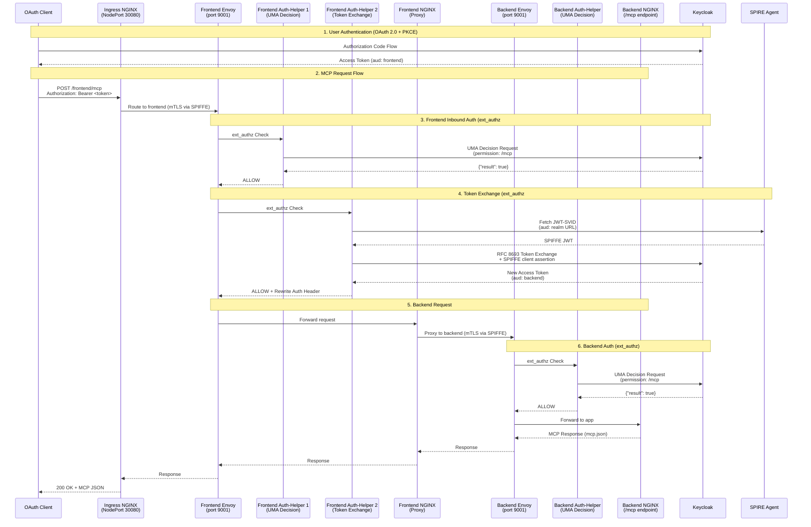
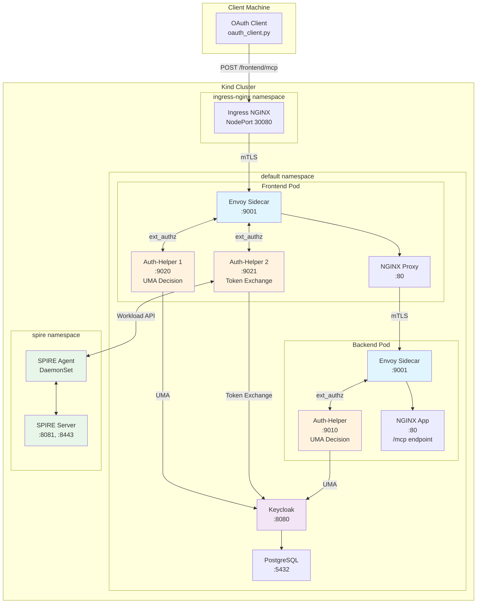

# Architecture Diagrams

## Request Flow Diagram

The following diagram shows the flow of an authenticated request from the OAuth client through the ingress to the backend MCP endpoint:

## Container Architecture

### Legend

| Color | Component Type |
|-------|---------------|
| Blue (#e1f5fe) | Envoy Proxy |
| Orange (#fff3e0) | Auth-Helper |
| Purple (#f3e5f5) | Keycloak |
| Green (#e8f5e9) | SPIRE |
